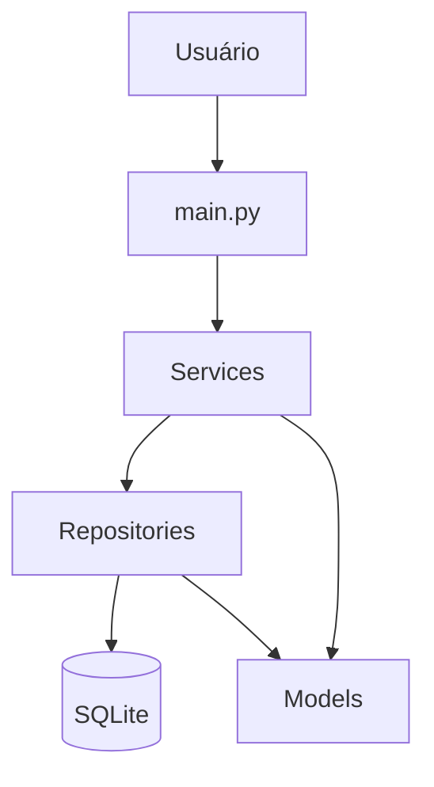

# Arquitetura do PEP Start

## Visão geral

## `main.py`

É a camada de interação. Mostra menus, solicita entradas e apresenta resultados. Não contém SQL.

## Models

As classes `Paciente`, `Alergia` e `Atendimento` representam os dados usados dentro do programa. Elas não conhecem detalhes de SQL.

## Services

`PacienteService` e `ProntuarioService` concentram regras como validação de datas, telefone, existência de paciente e proteção de exclusão.

## Repositories

Os repositories executam `INSERT`, `SELECT`, `UPDATE` e `DELETE`. Também convertem as linhas retornadas pelo SQLite para objetos Python.

## Database

`database/conexao.py` controla a abertura e o fechamento das conexões. Em caso de sucesso realiza `commit`; em caso de exceção realiza `rollback`.

## Por que não usamos Controller, API ou ORM?

Porque o projeto é deliberadamente pequeno. Introduzir essas camadas agora aumentaria a quantidade de conceitos sem resolver um problema real do escopo. Projetos posteriores podem evoluir para arquitetura web e frameworks.
