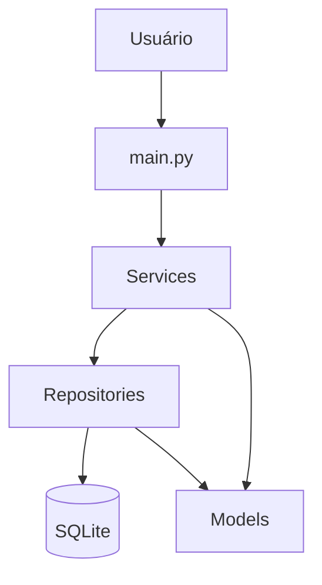
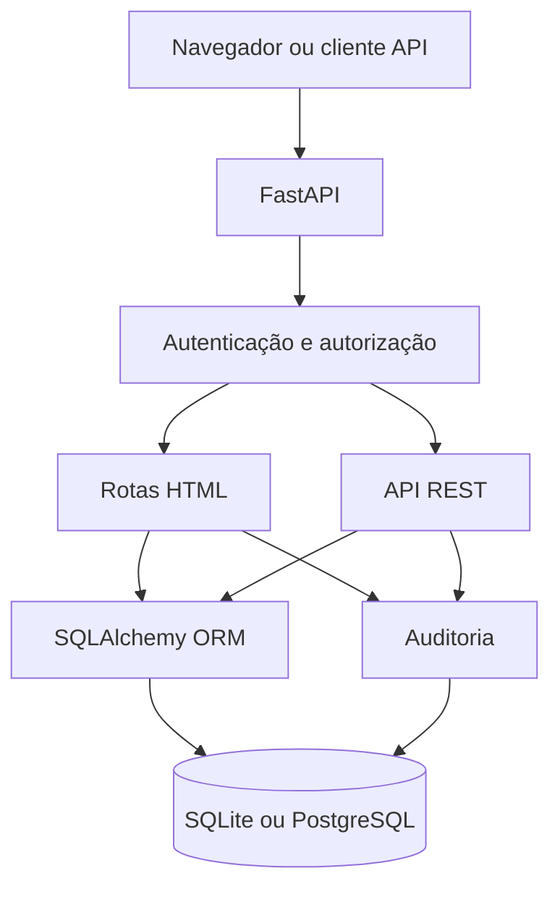

# Arquitetura do PEP Start

## Visão da evolução

O repositório mantém duas arquiteturas para mostrar progressão pedagógica.

### Versão 1 — terminal

A versão de terminal permite visualizar SQL e separação de responsabilidades sem framework web.

### Versão 2 — web

## FastAPI

É o framework responsável por receber requisições HTTP e direcioná-las para funções Python. A aplicação possui rotas HTML e rotas JSON.

## SQLAlchemy

A versão web utiliza ORM. Classes como `Paciente`, `Usuario`, `Exame` e `Auditoria` são mapeadas para tabelas. O ORM continua usando um banco relacional e SQL por baixo.

## `web_app/routes/auth.py`

Cuida da configuração inicial, login e logout.

## `web_app/routes/pacientes.py`

Cuida das páginas de pacientes, paginação e registros clínicos fictícios.

## `web_app/routes/admin.py`

Cuida de usuários e auditoria; essas rotas são restritas a `ADMIN`.

## `web_app/routes/api.py`

Expõe a primeira API REST do projeto. As mesmas regras de perfil são reaproveitadas.

## `web_app/security.py`

Concentra hash de senha, verificação de senha, sessão, CSRF e decorators/dependências de permissão.

## `web_app/audit.py`

Centraliza gravação de eventos de auditoria.

## Banco

SQLite continua sendo o padrão. A camada SQLAlchemy permite configurar PostgreSQL usando `DATABASE_URL`.
