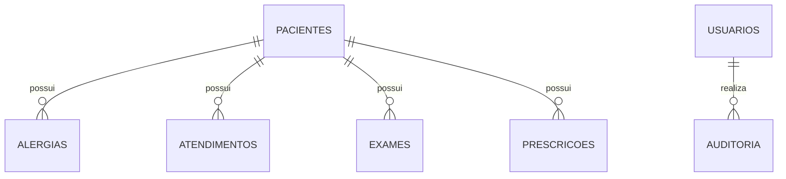

# Modelagem do banco de dados

## Por que SQLite?

SQLite foi escolhido porque não exige instalação de um servidor de banco de dados e permite estudar SQL, relacionamentos e persistência sem adicionar configuração desnecessária ao primeiro projeto.

## Tabela `pacientes`

| Campo | Tipo | Regra |
|---|---|---|
| `id` | INTEGER | PK, AUTOINCREMENT |
| `nome` | TEXT | NOT NULL |
| `data_nascimento` | TEXT | NOT NULL, formato ISO `AAAA-MM-DD` |
| `telefone` | TEXT | opcional |

## Tabela `alergias`

| Campo | Tipo | Regra |
|---|---|---|
| `id` | INTEGER | PK, AUTOINCREMENT |
| `paciente_id` | INTEGER | FK para `pacientes.id` |
| `descricao` | TEXT | NOT NULL |

Há uma restrição única formada por `paciente_id + descricao COLLATE NOCASE`, impedindo duplicidade simples da mesma alergia no mesmo paciente.

## Tabela `atendimentos`

| Campo | Tipo | Regra |
|---|---|---|
| `id` | INTEGER | PK, AUTOINCREMENT |
| `paciente_id` | INTEGER | FK para `pacientes.id` |
| `data` | TEXT | NOT NULL, formato ISO |
| `motivo` | TEXT | NOT NULL |
| `observacao` | TEXT | opcional |

## Relacionamentos

- Um paciente pode possuir zero ou muitas alergias.
- Cada alergia pertence a exatamente um paciente.
- Um paciente pode possuir zero ou muitos atendimentos.
- Cada atendimento pertence a exatamente um paciente.

## Chaves estrangeiras

As FKs existem para impedir registros clínicos órfãos. `ON DELETE RESTRICT` bloqueia a remoção direta de paciente que ainda tenha alergia ou atendimento associado.

## Índices

O schema cria índices para nome de paciente e relacionamentos por `paciente_id`. Eles ajudam o banco a localizar dados usados com frequência nas consultas.

## Evolução da modelagem web

Além das tabelas iniciais, a versão web adiciona:

### `exames`

- `id` — PK;
- `paciente_id` — FK para `pacientes`;
- `nome`;
- `data_exame`;
- `status`;
- `resultado`;
- `observacao`.

### `prescricoes`

- `id` — PK;
- `paciente_id` — FK;
- `medicamento`;
- `dose`;
- `frequencia`;
- `data_prescricao`;
- `observacao`.

### `usuarios`

- `id` — PK;
- `nome`;
- `email` — único;
- `senha_hash`;
- `perfil`;
- `ativo`;
- `criado_em`.

### `auditoria`

- `id` — PK;
- `usuario_id` — FK opcional;
- `acao`;
- `recurso`;
- `recurso_id`;
- `detalhes`;
- `ip`;
- `criado_em`.

