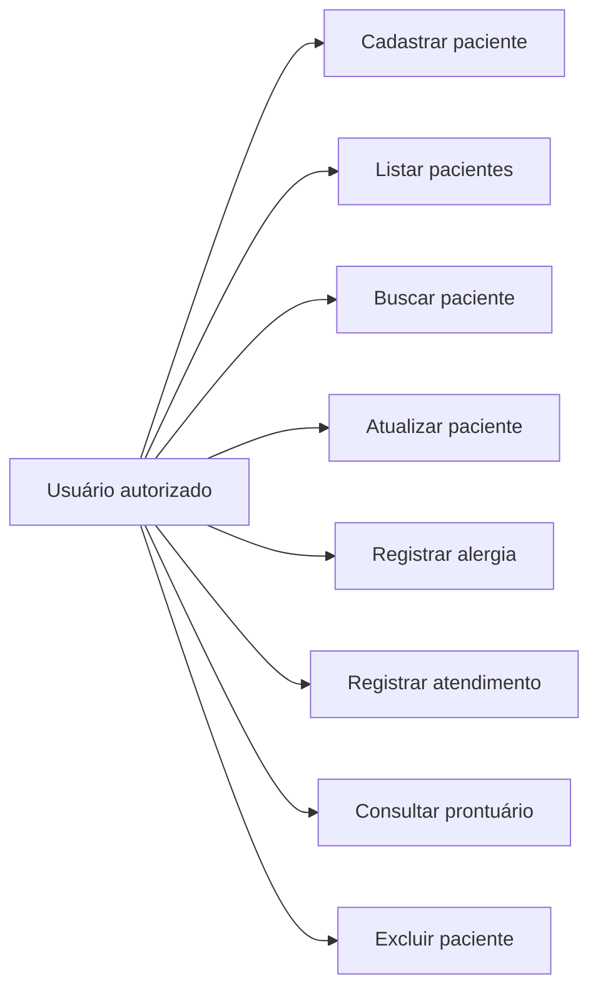
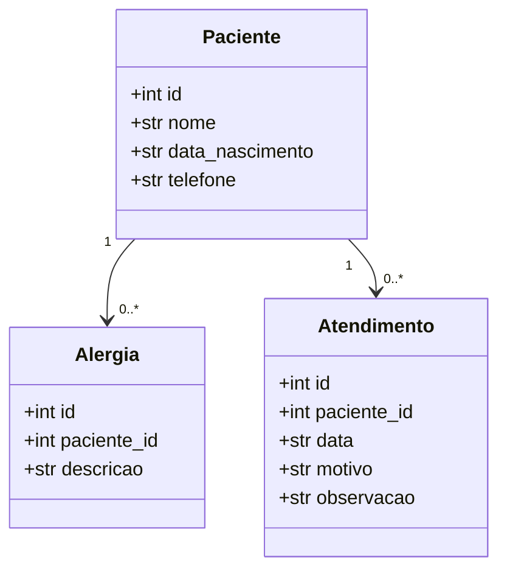

# UML — PEP Start

## Casos de uso

O ator representa quem opera a aplicação acadêmica. Nesta versão não há autenticação nem perfis distintos.

## Diagrama de classes simplificado

### Cardinalidades

`1` significa exatamente um. `0..*` significa zero ou muitos. Portanto, um paciente pode não possuir registros ainda ou pode possuir vários.

## Classes de infraestrutura

Além das entidades, a implementação usa repositories e services. Eles foram omitidos do diagrama acima para manter a leitura inicial simples, mas o fluxo arquitetural está documentado em `arquitetura.md`.
